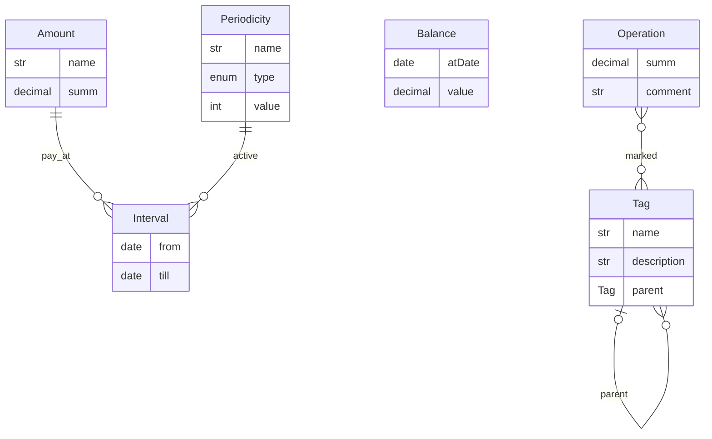

Data base diagram

    

```mermaid
erDiagram
    Amount ||--o{ Interval : pay_at
    Amount{
        str name
        decimal summ
    }
    Interval{
        date from
        date till
    }

    Periodicity ||--o{ Interval : active
    Periodicity {
        str name
        enum type
        int value
    }

    Balance {
        date atDate
        decimal value
    }

    Tag |o--o{ Tag : parent
    Tag {
        str name
        str description
        Tag parent
    }
    Operation }o--o{ Tag : marked
    Operation{
        decimal summ
        str comment
    }
```

